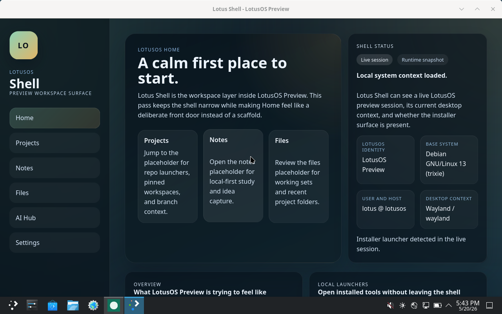
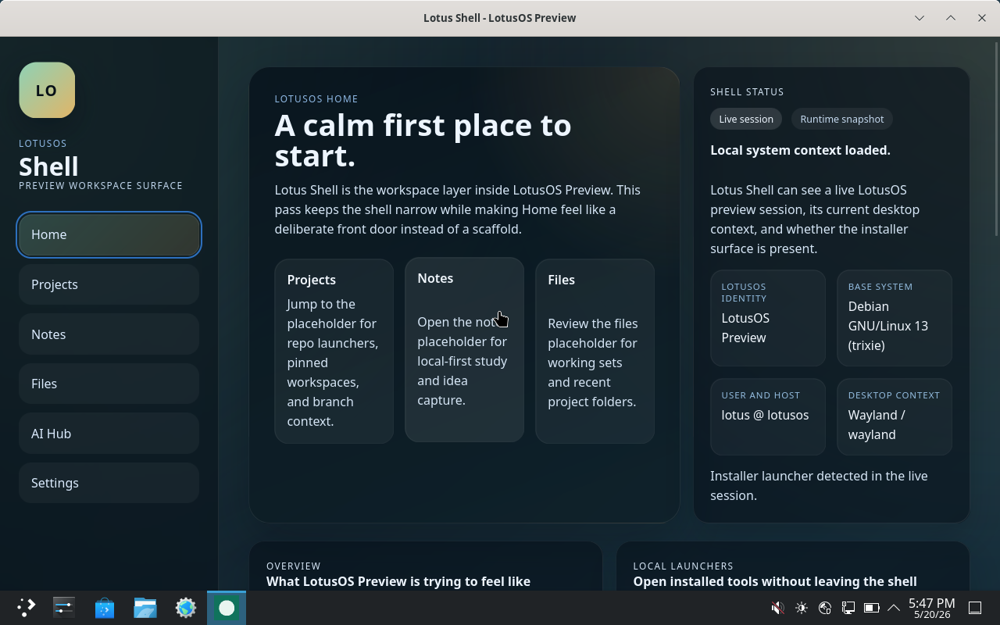
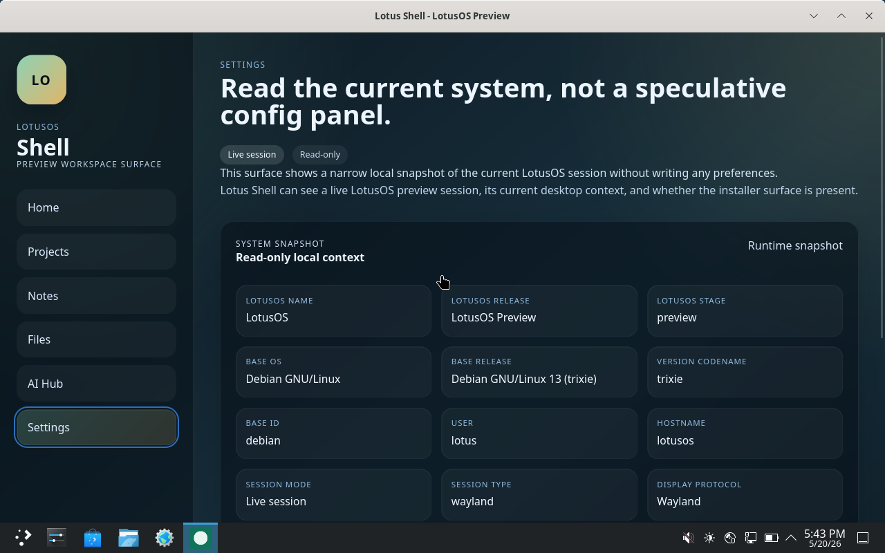
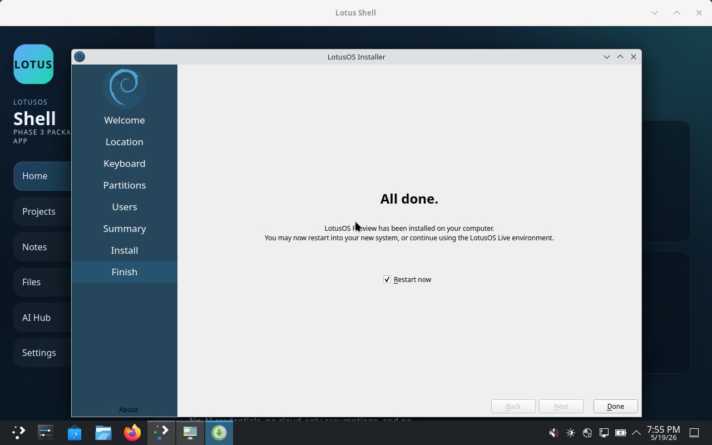
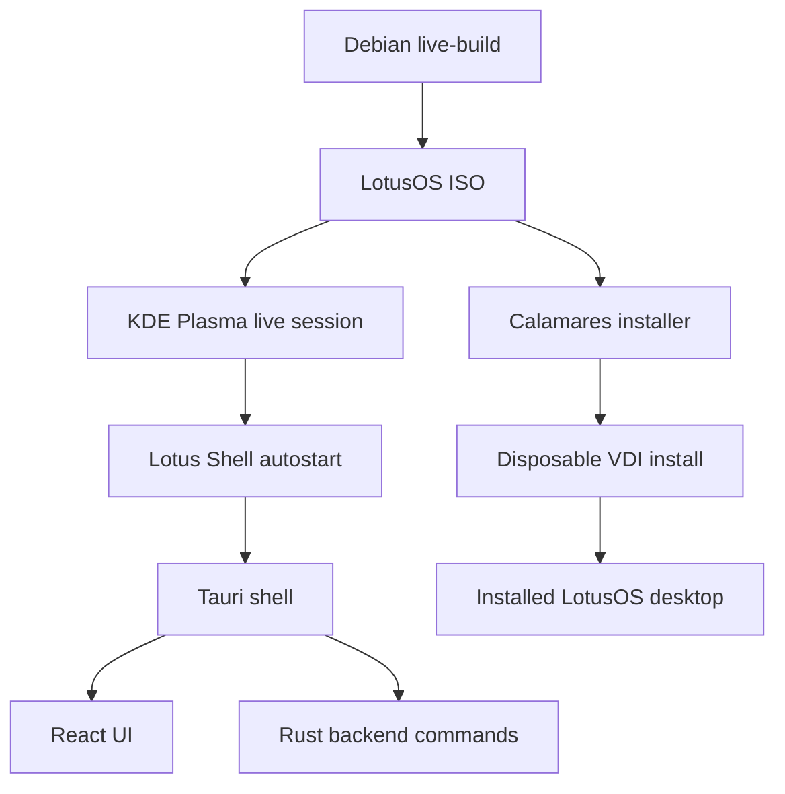

# LotusOS

## What this is

LotusOS is a custom Debian-based Linux live/installable ISO with a Tauri + React + Rust shell called Lotus Shell. It boots into KDE Plasma, autostarts Lotus Shell, and includes a Calamares installer that has been verified on disposable VirtualBox VDIs. The current preview is a source-and-docs milestone for a local-first workspace OS, not a production hardware release.

## Problem it solves

LotusOS explores how to turn a normal Linux base into a focused, calm, local-first workspace OS without writing a custom kernel or bootloader from scratch. Instead of leaving users in a generic desktop with scattered entry points, it adds a first-run home surface, local system context, app launchers, and bounded project and resource areas on top of a standard Debian + KDE base.

## Demo









## Screenshots

| Screenshot | Evidence |
| --- | --- |
| Live desktop |  |
| Home dashboard |  |
| Settings overview |  |
| Installer completion |  |

Installed-system boot, SDDM, and post-login Lotus Shell were manually verified for Phase 5F, but no additional installed-desktop screenshot is curated in this README set.

## How it works and how to use

1. Build the ISO through Debian `live-build`.
2. Boot the ISO in VirtualBox.
3. KDE Plasma starts in the live session.
4. Lotus Shell autostarts.
5. Calamares can install the image to a disposable VDI.
6. The installed system boots into SDDM and Plasma.
7. Lotus Shell autostarts again after installed login.

## Features

- Debian-based live ISO
- KDE Plasma desktop
- Lotus Shell autostart
- Polished Home dashboard
- Read-only system snapshot
- Settings system overview
- Local app launcher surface
- Local resource and project cards
- Calamares installer integration
- Disposable VDI install verification
- Local-first scope
- No bundled AI credentials

## Tech stack and architecture



- Debian `live-build`
- KDE Plasma
- Calamares
- Tauri
- React
- TypeScript
- Rust
- VirtualBox verification

## Detailed setup instructions

### Prerequisites

Use Linux or WSL2 Ubuntu for ISO work. The OS build scripts are Bash scripts and are not intended to run directly in PowerShell.

```bash
sudo apt update
sudo apt install live-build qemu-system-x86 xorriso isolinux syslinux-common squashfs-tools
sudo apt install nodejs npm cargo rustc libgtk-3-dev libwebkit2gtk-4.1-dev librsvg2-dev
```

If the distro Rust toolchain is too old for the Tauri packaging path, install a current stable Rust toolchain with `rustup`.

### Clone the repo

```bash
git clone https://github.com/ChimdumebiNebolisa/LotusOS.git
cd LotusOS
```

### Shell dependency install

```bash
cd shell/lotus-shell
npm install
```

### Local shell build

```bash
cd shell/lotus-shell
npm run build
```

### Tauri build and checks

```bash
cd shell/lotus-shell/src-tauri
cargo check
cd ..
npm run tauri build -- --no-bundle
```

### ISO build from WSL/Linux

Repository-root dependency check:

```bash
bash os/scripts/build-iso.sh --check
```

Build the ISO:

```bash
bash os/scripts/build-iso.sh
```

WSL root build with user `rustup` paths exported:

```bash
wsl.exe -u root -- /usr/bin/bash -c 'export CARGO_HOME=/home/<user>/.cargo RUSTUP_HOME=/home/<user>/.rustup PATH="/home/<user>/.cargo/bin:/usr/local/sbin:/usr/local/bin:/usr/sbin:/usr/bin:/sbin:/bin"; cd /mnt/c/Users/Chimdumebi/LotusOS && bash os/scripts/build-iso.sh'
```

### ISO content verification

```bash
wsl.exe -u root -- /usr/bin/bash os/scripts/verify-iso-contents.sh
```

### VirtualBox boot testing

Primary supported VirtualBox lane:

- OS type: Debian 64-bit
- RAM: `4096 MB`
- CPUs: `2`
- VRAM: `128 MB`
- Graphics controller: `VMSVGA`
- 3D acceleration: `on`

Optional QEMU smoke boot:

```bash
bash os/scripts/test-qemu.sh artifacts/lotusos-amd64.iso
```

## Testing

- `cd shell/lotus-shell && npm run build`
- `cd shell/lotus-shell/src-tauri && cargo check`
- `cd shell/lotus-shell && npm run tauri build -- --no-bundle`
- `wsl.exe -u root -- /usr/bin/bash os/scripts/verify-iso-contents.sh`
- VirtualBox live ISO verification
- Disposable VDI install verification

## Known limitations

- VirtualBox graphics and session instability has appeared in some timed runs, even in the supported `VMSVGA` + 3D `on` lane.
- Hardware installation is not verified.
- ISO and VDI artifacts are not committed to git.
- AI Hub is placeholder/local-first only.
- No cloud sync or auth.
- No production release guarantees.
- Phase 5F installed-system verification is manually verified after an automated Calamares run was blocked by a live-session lock.

## License

MIT. See [LICENSE](C:/Users/Chimdumebi/LotusOS/LICENSE).
